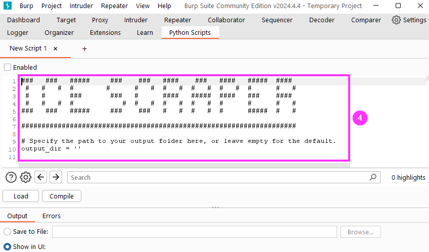

*The CAPTCHA-resilient contact scraper.*

---

## Description

Ice Scraper is a tool to perform bulk collection of employee names (and sometimes titles, location, etc.) from open source intelligence sources on the internet.

Ice Scraper gathers data from the browser via Burp Proxy. This allows Ice Scraper get around anti-scraping measures such as CAPTCHAs because, unlike command-line scraping tools, the user is able to interact with the website as normal and complete CAPTCHAs in the browser.

---

## Setup

1. Install the Python Scripter extension in Burp Suite.
2. Click on thhe Python Scripts tab that appears.
3. Then click the plus (`+`) to add a new script.


4. Copy and paste the contents of `ice_scraper.py` into the script pane at the top of the window.



5. Optionally set your desired output location by changing the value of the `output_dir` variable at the top of the script.
	- The default output location (if unchanged) is the user's home directory on Linux/Mac and the user's Desktop on Windows.
6. Click the Compile button.
7. Then check the Enabled box to enable the script.


---

## Usage

After completing the setup instructions:

1. Proxy your browser through Burp suite.
2. Perform the steps below, depending on which service you want to scrape.


### Scraping LinkedIn (Unauthenticated)

This scraping method scrapes employee names from their LinkedIn profile page titles, as they appear in Google search results.

1. Find the target company on LinkedIn to get the exact company name, as it appears on the company's LinkedIn page.
2. Search Google for the following search query, replacing `{COMPANY NAME}` with the name of the company you are targeting.

```
site:linkedin.com inurl:linkedin.com/in/ "at {COMPANY NAME}"
```


3. Ice Scraper will collect names and additional information from the search results displayed in your browser.
	- This output will appear in the Output tab within Python Scripter.
	- The output will also be saved to the file, `scraper-linkedin_unauth.csv`.


4. Scroll to the bottom of the page, and then click through to every additional page of Google search results. As you scroll down the page and click through additional pages of search results, more names will be logged by Ice Scraper.


### Scraping LinkedIn (Authenticated)

This scraping method scrapes employee names and titles from the People section of the employer's LinkedIn page.

1. Connect with people at the target company on LinkedIn.
	- You will often only be able to view the name and title of individuals connected with you directly or who are connected to someone you are connected with ("3rd"). Connecting with a handful of people at the target company is usually a fast and easy way to make the names of almost everyone at the company visible to your account. 
	- You do not need to proxy your traffic through Burp while completing this first step.
2. Log into LinkedIn and visit the company's LinkedIn page.
3. Begin proxying your browser through Burp.
4. Click the "People" link on the company page.
5. Scroll down to the bottom, and keep loading more results when/if prompted. As you scroll down the People page, names and titles will be automatically logged by Ice Scraper.
	- This output will appear in the Output tab within Python Scripter.
	- The output will also be saved to the file, `scraper-linkedin_auth.csv`.


### Scraping ZoomInfo (Unauthenticated)

This scraping method scrapes employee names, titles, and locations from ZoomInfo.

1. First, use the following Google search to find the company's page on ZoomInfo.


2. Visit the company's ZoomInfo page.
3. On the ZoomInfo website, scroll down to the "View Employees" section, and click on "Find more contacts".


4. Names, titles, and locations will be logged by Ice Scraper when the page loads.
	- This output will appear in the Output tab within Python Scripter.
	- The output will also be saved to the file, `scraper-zoominfo.csv`.


5. Scroll to the bottom of the page. Additional pages may be available. Click through additional pages to collect additional names.


### Converting names into email addresses/usernames

Two scripts are included to convert the collected names into lists of email addresses or usernames.

- `generate-usernames.py`
- `generate-usernames-csv.py`

Run either script with the `--help` flag for usage instructions.

---

## Credits

Big thanks to these folks, who created other projects that I learned from and adapted to create Ice Scraper:

- **Carrie Roberts ([@clr2of8](https://github.com/clr2of8))** - For creating [Gather-Usernames-From-Google-LinkedIn-Results](https://github.com/clr2of8/Gather-Usernames-From-Google-LinkedIn-Results). Her project was how I learned about Python scripting in Burp, and the unauthenticated LinkedIn scraping function is based on the same technique she used.
- **[@EatonChips](https://github.com/EatonChips)** - Creator of the [yalis](https://github.com/EatonChips/yalis) tool, on which the authenticated LinkedIn scraping function was based.

---

## Additional info

If Ice Scraper is interesting or useful to you, you might also enjoy my class, ***[Red Team Initial Access](https://www.antisyphontraining.com/live-courses-catalog/red-team-initial-access/)***, where you can get hands-on training on Ice Scraper and all the other tools and techniques I currently use to break into well-defended, enterprise environments over the internet.

[Check out ***Red Team Initial Access*** here, on AntiSyphon.<br><br>](https://www.antisyphontraining.com/live-courses-catalog/red-team-initial-access/)
